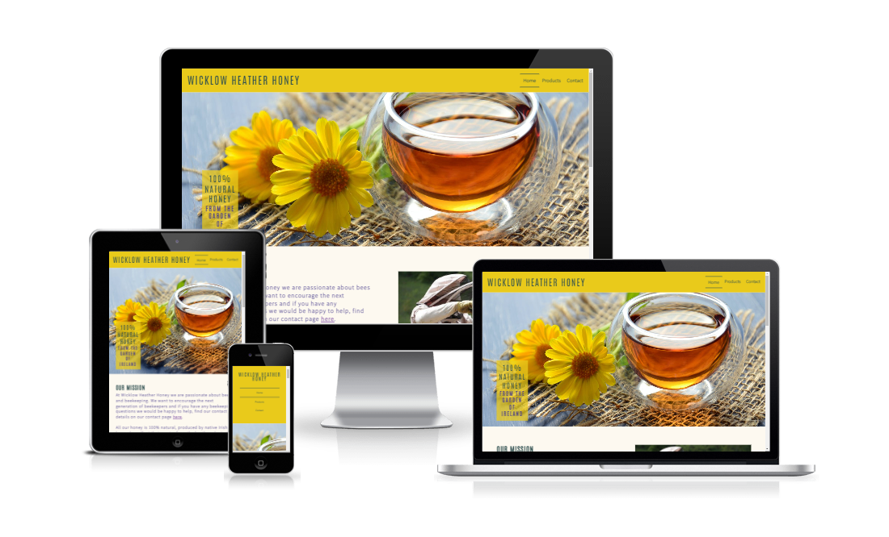
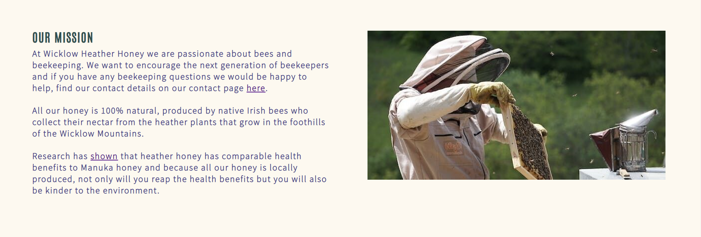
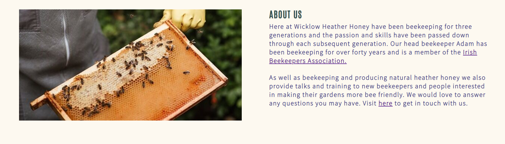
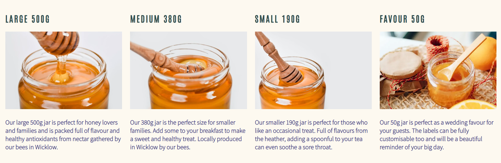
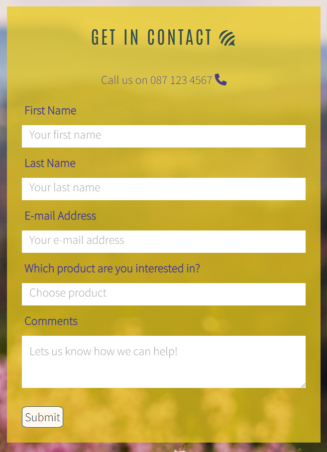
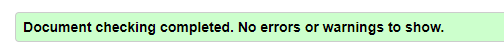
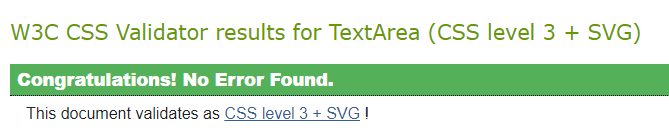
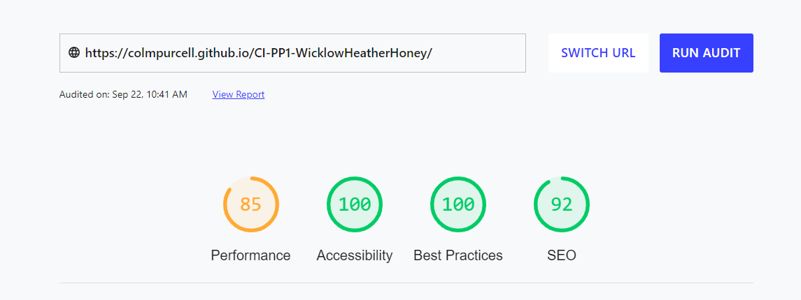

# Wicklow Heather Honey
Wicklow Heather Honey is a fictional honey company which produces 100% natural heather honey in Wicklow, Ireland. The target audience is anyone looking to find locally produced honey or are looking to find out more about beekeeping.

The websites intent is to show our audience the products available, where we can be found and provide contact details for any questions or special requests.

The deployed live website can be found [here](https://colmpurcell.github.io/CI-PP1-WicklowHeatherHoney/)

## Table of Content
To be added later

## UX

### Site Goal:

To provide information for people looking for 100% Natural Heather Honey produced in Wicklow, Ireland. To provide product information to potential customers. To provide contact details and the ability for potential customers to leave comments or ask questions to the site owners.

### Site Demographics:

- Users looking for naturally produced heather honey.
- Users interested in becoming beekeepers.

### Existing User Goals:

- As an existing user: I want to be able to find contact information.
- As an existing user: I want to be able to find location information.

### New User Goals:

- As a new user: I want to be able to find out what products are available.
- As a new user: I want to be able to find out about the health benefits of heather honey.

## Design

### Colour Scheme:

The colour palette was chosen with accessibility in mind. The yellow colour #E9CA1B used in both the header and the footer was chosen to represent the golden honey. Text colours of darkslategrey and darkslateblue in combination with the off white background colour of #F9F9F0 used for the body of the page allow for easy readability while not being overwhelming. The website [mycolor.space](https://mycolor.space/) aws used to create the color palette.

### Typography:

The Google font [Antonio](https://fonts.google.com/?query=Antonio) was chosen for the main font for h1 and h2 headings with a fallback of Sans-Serif.

The Google font [Source Sans Pro](https://fonts.google.com/specimen/Source+Sans+Pro?query=Source+sans+pro) was used h3 and lower and paragraphs.

These fonts in combination give a clean appearance and high readability.

### Images:

All images where taken from the free images website [Plexels.com](https://www.pexels.com/) and will be credited in the credits section. Images where chosen to have a consistant feel across the site.

## Features

### Header with navigation menu:

The Header apperars across all pages. It features a logo and navigation menu which highlights which page you are currently on. The logo and menu items highlight when a user hovers over them. The logo when clicked brings users back to the home page It is fully responsive on smaller screens.

### Footer with social media links:

The Footer apperars across all pages. It features social media icons which highlight when a user hovers over them and links to the relavent social media pages opening in a new tab. It is fully responsive on smaller screens.

### Main Page Hero Image:

The Hero Image features yellow colours to tie in with the header, it also has cover text inspired by the Love Running coding project.

### Our Mission  and About Us sections:

These sections contains text featuring links and an assocciated image. They are fully responsive depending on screen size. On large screens they appear as two colums and two rows, with text on the left followed by the image, then image on the left followed by text. On smaller screens they appear in one column with text followed by the image.

### Google Map iframe:

The home page features a Google Maps iframe where users can see our location.

### Our Products section:

The products section features information and images of our products. Its fully responsive, showing 4 columns on large screens, reducing to two on smaller screens and one column on mobile screens so as to be eaisily readable.

### Contact Us section:

The contact form allows users to get in contact and specify what product they are interested in. It also allows users to submit commets or questions to the site owner.
The form sends the information to https://formdump.codeinstitute.net/ and gives a message that the information has been sent correctly.

## Testing

### Validator Testing:

The code validation was tested using [W3C validator](https://validator.w3.org/) for html, one error was found as I had put height and width attributes into the code for the Google maps iframe, I resolved this by removing the properties from the iframe and changing the height and with properties using css instead and it passed with no issues found.

The code validation was tested using [Jigsaw validator](https://jigsaw.w3.org/css-validator/) for css with no issues found.

## Lighthouse Audit:

A performance audit was carried out using [web.dev/measure](https://web.dev/measure/) and the site scores high across all areas with scores of 100 for both Accessibility and Best Practices.

The site was tested using Chrome, Safari & Edge browers with no issues.
The site was tested on a range of devices including iphone 11 and 13, Samsung Galaxy S10 and 
