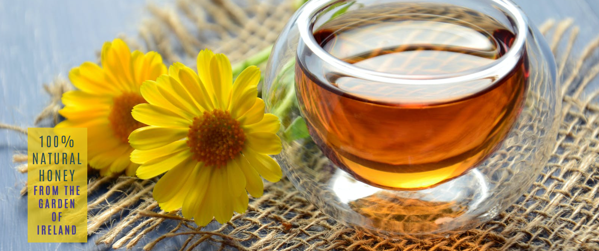
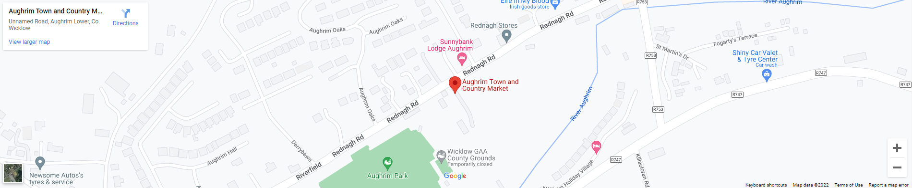

# Wicklow Heather Honey
Wicklow Heather Honey is a fictional honey company which produces 100% natural heather honey in Wicklow, Ireland. The target audience is anyone looking to find locally produced honey or are looking to find out more about beekeeping.

The websites intent is to show our audience the products available, where we can be found and provide contact details for any questions or special requests.

The deployed live website can be found [here](https://colmpurcell.github.io/CI-PP1-WicklowHeatherHoney/)

## Table of Content

1. [UX](#ux)
    1. [Site Goal](#site-goal)
    2. [Site Demographics](#site-demographics)
    3. [Existing User Goals](#existing-user-goals)
    4. [New User Goals](#new-user-goals)
2. [Design](#design)
    1. [Colour Scheme](#colour-scheme)
    2. [Typography](#typography)
    3. [Images](#images)
3. [Features](#features)
    1. [Header With Navigation Menu](#header-with-navigation-menu)
    2. [Footer With Social Media Links](#footer-with-social-media-links)
    3. [Main Page Hero Image](#main-page-hero-image)
    4. [Our Mission & About Us section](#our-mission-and-about-us-sections)
    5. [Google Maps iframe](#google-map-iframe)
    6. [Our Products Section](#our-products-section)
    7. [Contact Us Section](#contact-us-section)
4. [Testing](#testing)
    1. [Validator Testing](#validator-testing)
    2. [Lighthouse audit](#lighthouse-audit)
    3. [Bugs & Fixes](#bugs-and-fixes)
5. [Technologies Used](#technologies-used)
    1. [Main Languages Used](#main-languages-used)
    2. [Libraries, Frameworks and Programmes](#libraries-frameworks-and-programmes)
6. [Deployment](#deployment)
7. [Media](#media)
8. [Credits](#credits)
9. [Acknowledgements](#acknowledgements)

## UX

### Site Goal:

To provide information for people looking for 100% Natural Heather Honey produced in Wicklow, Ireland. To provide product information to potential customers. To provide contact details and the ability for potential customers to leave comments or ask questions to the site owners.

### Site Demographics:

- Users looking for naturally produced heather honey.
- Users interested in becoming beekeepers.

### Existing User Goals:

- As an existing user: I want to be able to find contact information.
- As an existing user: I want to be able to find location information.

### New User Goals:

- As a new user: I want to be able to find out what products are available.
- As a new user: I want to be able to find out about the health benefits of heather honey.

## Design

### Colour Scheme:

The colour palette was chosen with accessibility in mind. The yellow colour #E9CA1B used in both the header and the footer was chosen to represent the golden honey. Text colours of darkslategrey and darkslateblue in combination with the off-white background colour of #F9F9F0 used for the body of the page allow for easy readability while not being overwhelming. The website [mycolor.space](https://mycolor.space/) was used to create the color palette.

### Typography:

The Google font [Antonio](https://fonts.google.com/?query=Antonio) was chosen for the main font for h1 and h2 headings with a fallback of Sans-Serif.

The Google font [Source Sans Pro](https://fonts.google.com/specimen/Source+Sans+Pro?query=Source+sans+pro) was used h3 and lower and paragraphs.

These fonts in combination give a clean appearance and high readability.

### Images:

All images were taken from the free images website [Plexels.com](https://www.pexels.com/) and will be credited in the credits section. Images were chosen to have a consistent feel across the site.

## Features

### Header with navigation menu:

The Header appears across all pages. It features a logo and navigation menu which highlights which page you are currently on. The logo and menu items highlight when a user hovers over them. The logo when clicked brings users back to the home page It is fully responsive on smaller screens.

### Footer with social media links:

The Footer appears across all pages. It features social media icons which highlight when a user hovers over them and links to the relevant social media pages opening in a new tab. It is fully responsive on smaller screens.

### Main Page Hero Image:

The Hero Image features yellow colours to tie in with the header, it also has cover text inspired by the Love Running coding project.

### Our Mission  and About Us sections:

These sections contain text featuring links and an associated image. They are fully responsive depending on screen size. On large screens they appear as two columns and two rows, with text on the left followed by the image, then image on the left followed by text. On smaller screens they appear in one column with text followed by the image.

### Google Map iframe:

The home page features a Google Maps iframe where users can see our location.

### Our Products section:

The products section features information and images of our products. Its fully responsive, showing 4 columns on large screens, reducing to two on smaller screens and one column on mobile screens so as to be easily readable.

### Contact Us section:

The contact form allows users to get in contact and specify what product they are interested in. It also allows users to submit comments or questions to the site owner.
The form sends the information to https://formdump.codeinstitute.net/ and gives a message that the information has been sent correctly.

## Testing

### Validator Testing:

The code validation was tested using [W3C validator](https://validator.w3.org/) for html and it passed with no issues found.

The code validation was tested using [Jigsaw validator](https://jigsaw.w3.org/css-validator/) for css with no issues found.

### Lighthouse Audit:

A performance audit was carried out using [web.dev/measure](https://web.dev/measure/) and the site scores high across all areas with scores of 100 for both Accessibility and Best Practices.

The site was tested using Chrome, Safari & Edge browers with no issues.
The site was tested on a range of devices including iphone 11 and 13, Samsung Galaxy S10 and A70 and Lenovo Smart Tab M10 plus with no issues found.

### Bugs and fixes:

1. Expected: Form is expected to send all information when its submitted.
 - Testing: Filled out form and clicked submit.
 - Result: Form data not being sent for both name and email fields on contact page.
 - Fix: The inputs for first name, last name and e-mail weren't named. Once these inputs were named correctly the form worked as it should and all information was sent correctly.
2. Expected: The footer scales down on mobile screens.
 - Testing: Used dev tools to see how footer behaves on mobile sized screens.
 - Result: The social media icons on mobile were appearing over two lines.
 - Fix: Used media query to display the icons at a smaller size on screens below 500px
3. Expected: The header and navigation menu scale down on mobile screens.
 - Testing: Used dev tools to see how header behaves on mobile sized screens.
 - Result: Header and navigation menu were too big on smaller screens and text appeared outside of the header area.
 - Fix: Created a new header and navigation bar using a [guide](https://frontendgyaan.com/how-to-create-a-responsive-header-menu-with-css/) on frontendgyann.com. I reused the logo and nav elements from my previous header and styled it to match my website.
4. Expected: Images and text area on home page would scale down on mobile sized screens.
 - Testing: Used dev tools to see how section behaves on mobile sized screens.
 - Result: Images and text area appeared too narrow on mission and about section on home page on smaller screens.
 - Fix: Changed the main-page-grid padding from px to % which made the page responsive on smaller screens and the section wasn't too narrow.
5. Expected: Correct fonts used consistently across all pages.
 - Testing: Checked font used across all pages.
 - Result: Found the incorrect font was used on the product banner.
 - Fix: Styled banner heading to the correct font.
6. Expected: Code validation would pass with no issues found.
 - Testing: The code validation was tested using [W3C validator](https://validator.w3.org/).
 - Result: One error was showing for unexpected height and width attribute in the google maps iframe.
 - Fix: I had put height and width attributes into the code for the Google maps iframe, I resolved this by removing the properties from the iframe and changing the height and with properties using css instead and it passed with no issues found.

  There are no know unfixed bugs and the project will now be submitted.

## Technologies Used

### Main Languages Used:

- HTML5
- CSS3

### Libraries, Frameworks and Programmes:
- Font Awesome: Used for icons for social media on the footer and bee and phone icon on the contact form.
- Google Fonts: Used to import the fonts Antonio and Source Sans Pro used for the headings and paragraphs respectively. A back up of sans-serif was used also.
- Github: Used to store my repository and deploy my page.
- Gitpod: Used to edit my code and push code to github.
- Balsamiq: Used to create wireframe mock-ups of the project.
- google Maps: Used to add map iframe to home page.

## Deployment:

Gitpod was used as the development environment, where regular commits and pushes to github were made and tracked.
The live version of the project site is deployed using Github pages and can be found [here](https://colmpurcell.github.io/CI-PP1-WicklowHeatherHoney/).

The steps for deployment are as follows:
- Log into Github.
- Locate the GitHub Repository to be deployed live.
- At the top of the repository, select Settings from the menu items.
- In the "Code and automation" section of the sidebar, click Pages.
- At the ”Source” section choose ”main” as Branch and root as folder and click ”Save”
- The website will be deployed and the page will refresh to provide the live link to the page.

## Media

All images were taken from [pexels.com](https://www.pexels.com/)

- [Clear glass bowl beside yellow flowers](https://www.pexels.com/photo/clear-glass-bowl-beside-yellow-flower-1638280/) by Mareefe
- [A man in beige beekeeper suit holding a hive frame](https://www.pexels.com/photo/a-man-in-beige-beekeeper-suit-holding-a-hive-frame-4505624/) by Dmitry Glazunov
- [Crop beekeeper holding honeycomb in yard](https://www.pexels.com/photo/crop-beekeeper-holding-honeycomb-in-yard-5247968/) by Anete Lusina
- [Liquid yellow honey in a glass jar](https://www.pexels.com/photo/liquid-yellow-honey-in-a-glass-jar-5634206/) by Adonyi Gábor
- [A honey in the jar](https://www.pexels.com/photo/a-honey-in-the-jar-5634213/) by Adonyi Gábor
- [Studio shot of honey with wooden stirring tool](https://www.pexels.com/photo/studio-shot-of-honey-with-wooden-stirring-tool-5634205/) by Adonyi Gábor
- [Jar of honey and a lemon](https://www.pexels.com/photo/jar-of-honey-and-a-lemon-6588618/) by ROMAN ODINTSOV
- [Heather flowers on a field](https://www.pexels.com/photo/heather-flowers-on-a-field-5337623/) by Ylanite Koppens
- [Calluna vulgaris blooming in field](https://www.pexels.com/photo/calluna-vulgaris-blooming-in-field-5407565/) by Kieren Ridley

## Credits

Inspiration was taken from some of the elements used in the love running project and built upon.

A guide to building a responsive header from [frontendgyaan.com](https://frontendgyaan.com/how-to-create-a-responsive-header-menu-with-css/) was used and built upon for this project.

## Acknowledgements

I would like to thank:

- Genevieve and Kathryn for helping with grammar and proof reading.
- Seán for giving great feedback and spotting issues.
- My wife Annelise for all the great feedback, advice and support.
- My Mentor, Mitko Bachvarov for pointing me towards using css grid and all the feedback, advice and support.